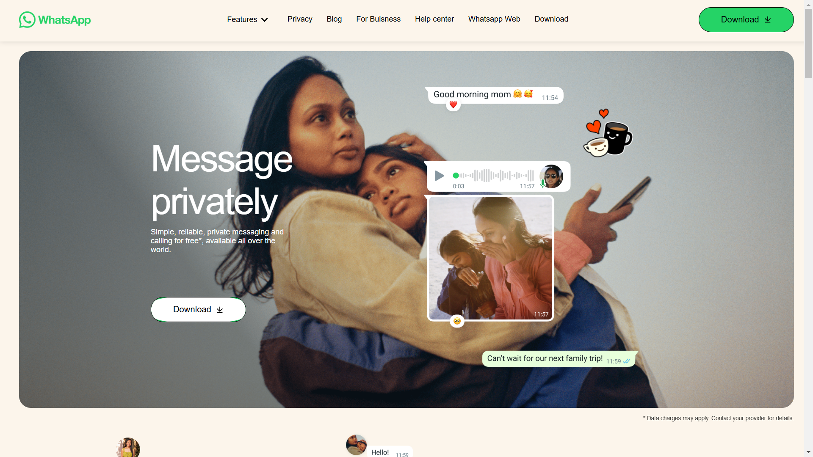

# WhatsApp Clone - HTML & CSS Only

## 📌 Project Overview
This project is a **WhatsApp Clone** built using only **HTML** and **CSS**. The goal of this project is to replicate the WhatsApp web interface with smooth animations, a responsive layout, and an interactive user experience without using JavaScript.

## 🎨 Features
- **Responsive Design**: Works across different screen sizes.
- **Sticky Navbar**: Navigation bar remains fixed at the top while scrolling.
- **Hover Effects**: Smooth underlining and button effects.
- **Animations**:
  - **Image Loading Animation**: Images appear with transition effects.
  - **Hover Animations**: Buttons and menu items have dynamic interactions.
  - **Fade-in & Slide Animations**: Smooth content transitions.
- **Custom WhatsApp-Themed UI**: Mimics the look and feel of WhatsApp Web.
- **No JavaScript Used**: Achieved all functionality using pure CSS.

## 🛠️ Technologies Used
- **HTML5**: Structure of the web page.
- **CSS3**: Styling, animations, and responsiveness.

## 📂 Project Structure
```
whatsapp-clone/
│── index.html          # Main HTML file
│── style.css           # Stylesheet for design and animations
│── assets/             # Contains images and icons
└── README.md           # Project documentation
```

## 🚀 Deployed Website
Check out the live version of the project here: [WhatsApp Clone Deployed](https://your-deployed-link.com)

## 📷 Screenshots


## 🎯 User Experience
- **Smooth Navigation**: Intuitive design ensuring a seamless experience.
- **Interactive Elements**: Buttons, menus, and animations enhance engagement.
- **Mobile-Friendly**: Optimized for both desktop and mobile devices.

## 🏆 Why This Project is Unique
- **Pure CSS Magic**: Achieved complex animations without JavaScript.
- **Pixel-Perfect Design**: Closely resembles WhatsApp Web.
- **Enhanced Accessibility**: Clean structure for a better user experience.

## 🎉 Acknowledgments
Special thanks to the open-source community for design inspiration!


